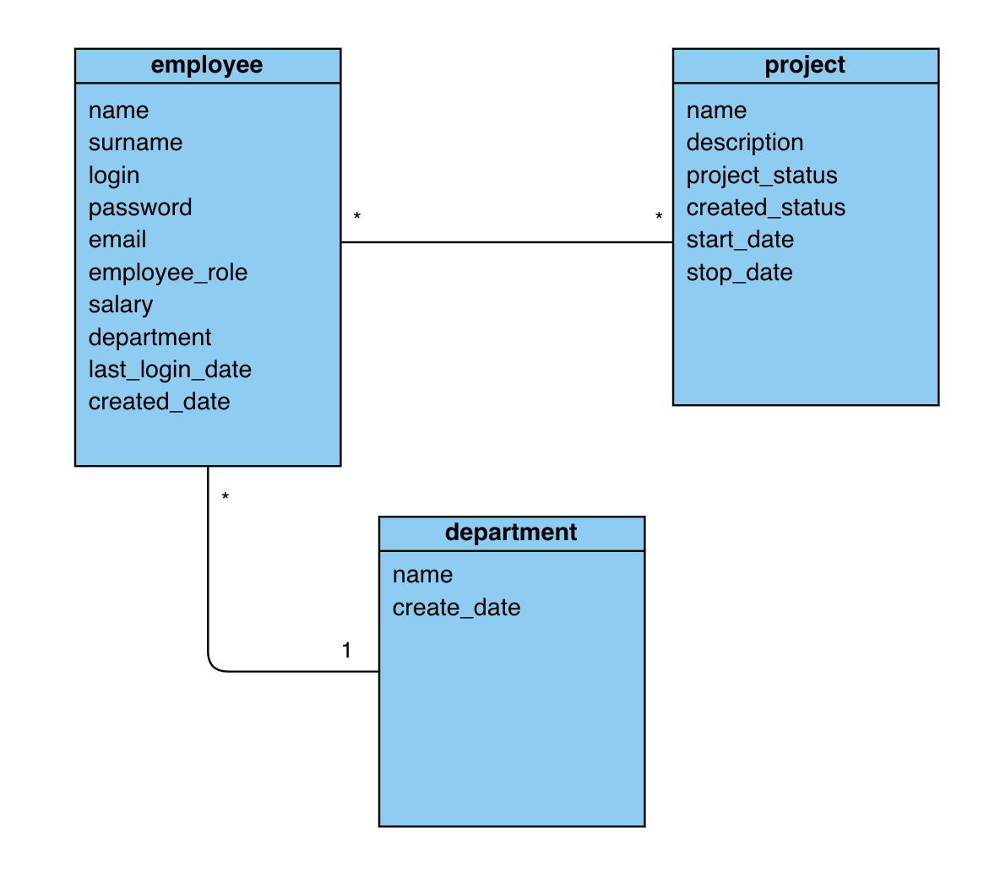

# SQL

Here is a `./assets/class_diagram.png`: 

This is a brief class diagram view:
* employee
* department
* project

There is a many-to-many relation between `employee` and `project` (employee can have many projects and project can have many employees) and one-to-many relation between `department` and `employee` (employee can be only in one department). 
There are few comments on diagram:
* `employee.employee_role` can be: Default, PM, Administrator;
* `employee.department` can be null (employee can have no department);
* `project.project_status` can be: Planned, Ongoing, Stopped;

## Exercises:
### 1. Based on `./assets/class_diagram.png` try to create a `Entity relationship diagram` using SQL commands (save all queries to `db.sql` file); 
### 2. * Fill db with random data;
### 3. Try to create next queries (save all queries to `queries.sql`):
#### 3.1 Get all employees full names from X departament;
#### 3.2 How many employees in X departament;
#### 3.3 Get all employees which have Y project;
#### 3.4 Get all department names which are involved into project;
#### 3.5 Select all projects with total amount of employees salaries is bigger than 10k;
#### 3.6 Delete all department with 0 employees;

## Output:

`db.sql` and `queries.sql`  filled with SQL queries. Create a screenshot of your db schema and a screenshot of console and attach them too.

